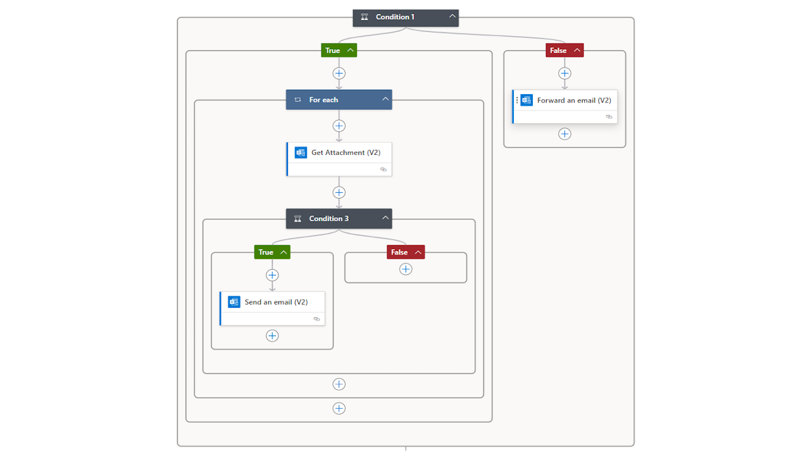

# Manual Inbound Document Filter
This manual describes how to set up and use the Inbound Document Filter app.

## Introduction
When you use inbound e-mails to feed a purchase invoice capturing functionality, there is some need to filter the incoming e-mail to make sure that unprocessable messages are not feeded into the solution.

The Inbound Document Filter app adds this filtering functionality by providing two components:
*   A Business Central app that enhances the Vendor Card with filter fields that can be set up.
*   A LogicApp which handles the actual filtering and forwarding on the e-mail account.

[:arrow_left:](../README.md) [Back](../README.md)