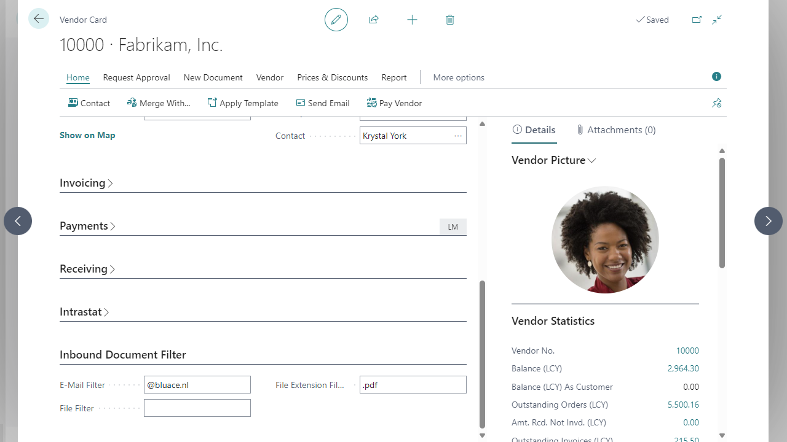

# Manual Inbound Document Filter
This manual describes how to set up and use the Inbound Document Filter app.

## Setting up filters
To set up filters for your inbound document, open the Vendor Card.

*   The E-Mail Filter is used to identify the vendor on the LogicApp side.
*   When the File Filter is applied, only e-mails that contain an attachment with the filter text in the attachment name will be forwarded.
*   This is also the case for the extension of the attachment and the File Extension Filter field.

[:arrow_left:](../README.md) [Back](../README.md)